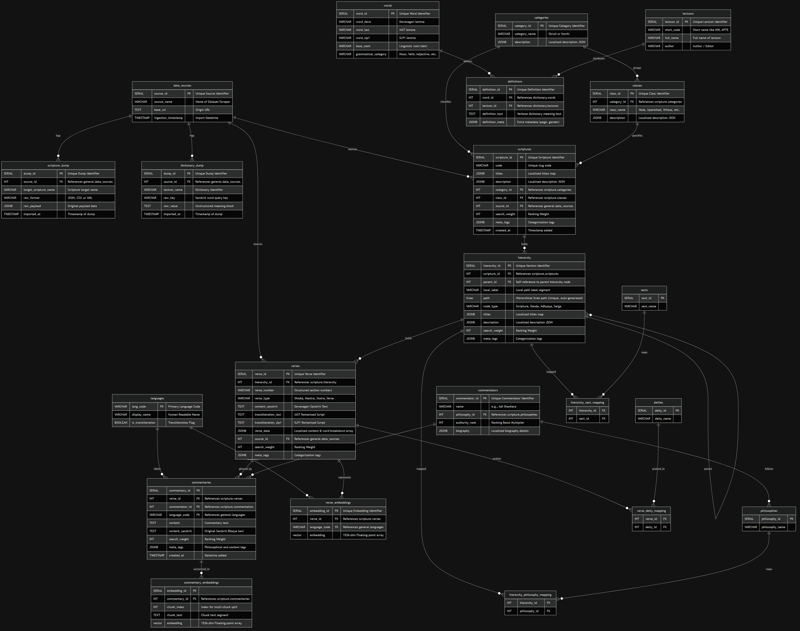
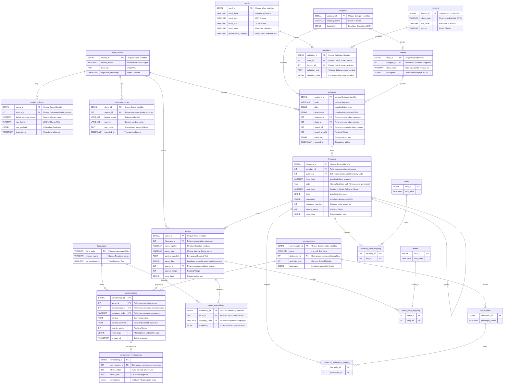
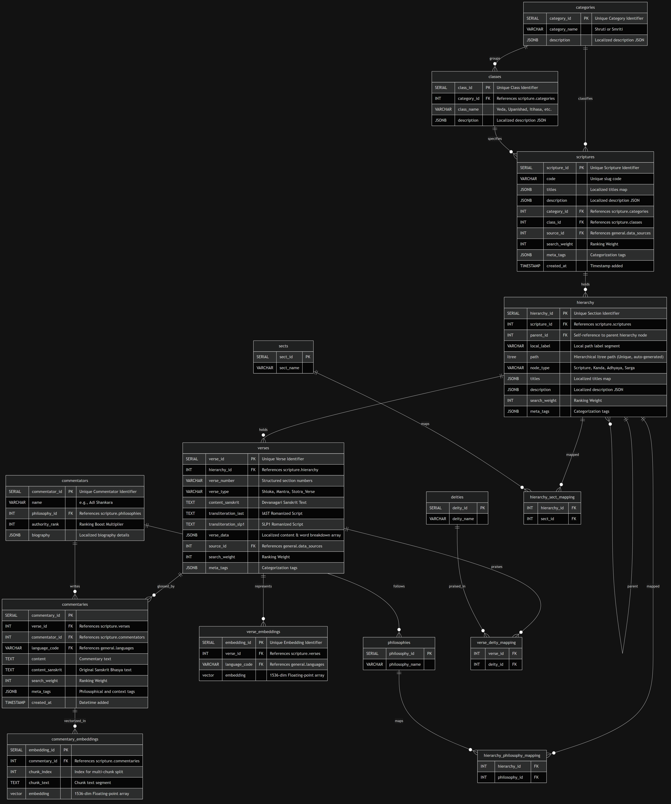
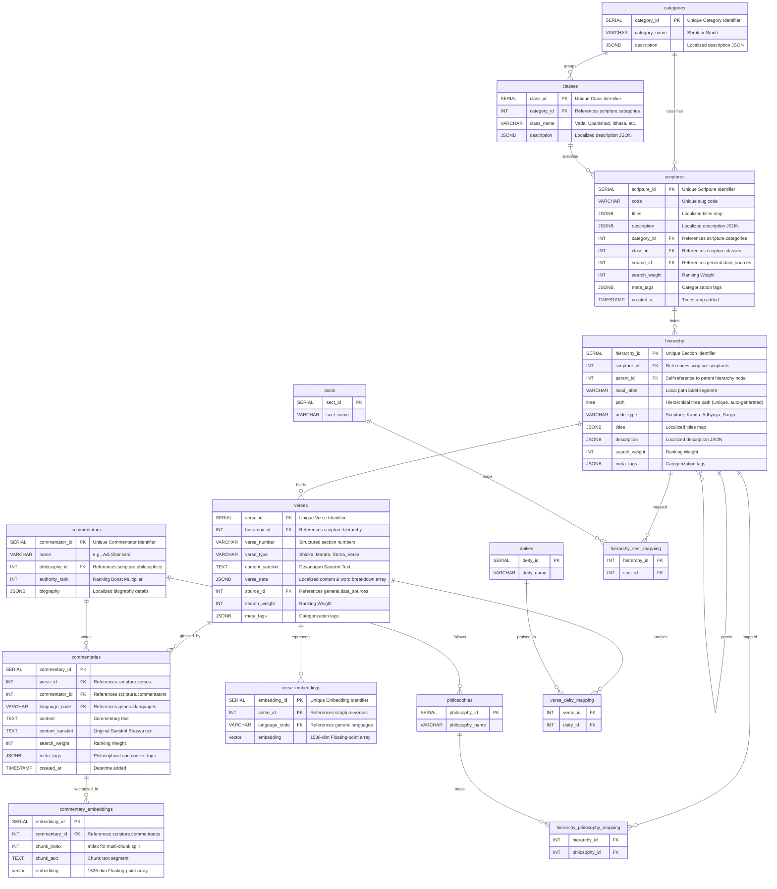

# Sanskrit Quest Scripture: Database Design Document

This document outlines the database architecture, schema definitions, table creation DDL, indexing layer, and entity relationships for the redesigned **Sanskrit Quest** backend.

---

## 1. Architectural Philosophy

The database design utilizes **PostgreSQL** as a multi-model database engine, handling relational data, hierarchical document trees, commentaries, text search, and high-dimensional vector embeddings within a unified, ACID-compliant storage engine.

```
                  ┌───────────────────────────────┐
                  │      raw_staging Schema       │
                  │   (ELT unstructured lander)   │
                  └───────────────┬───────────────┘
                                  │  Transform & Load
                                  ▼
      ┌────────────────────────────────────────────────────────┐
      │  scripture Schema           │  dictionary Schema       │
      │  • Hierarchy Tree (ltree)   │  • Sanskrit Lexicons     │
      │  • Verses & Commentaries    │  • Words (Lemmatization) │
      │  • Sects, Schools, Deities  │  • Multi-source refs     │
      └────────────────────────────────────────────────────────┘
```

### Key Design Pillars:
1. **Separation of Concerns via Schemas**: 
   - `general`: Shared parameterization (languages, data sources).
   - `raw_staging`: Lands unstructured or raw input data for ELT pipelines.
   - `scripture`: Handles structured hierarchy, verses, commentaries, metadata classifications, and semantic vectors.
   - `dictionary`: Manages words, stems, lexicons, and definitions.
2. **Hierarchical Traversal (`ltree`)**: Enables representing complex scripture nesting (Scripture $\rightarrow$ Canto/Kanda $\rightarrow$ Chapter/Sarga $\rightarrow$ Shloka) in `scripture.hierarchy` without slow recursive CTE query overhead.
3. **Commentary Integration**: Supports storing multiple philosophical commentaries (Bhāṣyas) per verse in `scripture.commentaries`, supporting multi-lingual vector RAG and full-text search.
4. **Metadata & Classification Mapping**: Dedicated normalization tables map text sections and verses to historical Sects, Philosophical Schools, and Deities.
5. **Hybrid Search (Sparse + Dense)**:
   - **Sparse Search**: Fuzzy match transliterations with trigram GIN indexes (`pg_trgm`) and English/Hindi Full-Text Search.
   - **Dense Search**: Semantic RAG queries via high-dimensional vectors (`pgvector`) with HNSW cosine similarity search.
6. **Metadata-Based Ranking**: Standardized search weights and categorization tags are embedded directly in core tables to rank and filter philosophical queries.

---

## 2. Extensions, Schemas, Domains & Table DDL

The following script contains the complete DDL setup for extensions, schemas, custom validation domains, and relational tables in their correct dependency execution order.

```sql
-- ========================================================================
-- 1. EXTENSIONS & SCHEMAS
-- ========================================================================
CREATE EXTENSION IF NOT EXISTS ltree;       -- For hierarchical tree path traversal
CREATE EXTENSION IF NOT EXISTS pg_trgm;     -- For fuzzy Sanskrit text searching
CREATE EXTENSION IF NOT EXISTS vector;      -- For pgvector AI RAG embedding support

CREATE SCHEMA IF NOT EXISTS general;
CREATE SCHEMA IF NOT EXISTS raw_staging;
CREATE SCHEMA IF NOT EXISTS scripture;
CREATE SCHEMA IF NOT EXISTS dictionary;

-- ========================================================================
-- 2. CUSTOM DOMAINS (JSON Schema Verification Constraints)
-- ========================================================================
-- Localized Description Schema
CREATE DOMAIN scripture.localized_description AS JSONB CHECK (
    jsonb_typeof(VALUE) = 'object' 
    AND VALUE ? 'en' AND jsonb_typeof(VALUE -> 'en') = 'string'
    AND VALUE ? 'hi' AND jsonb_typeof(VALUE -> 'hi') = 'string'
);

-- Localized Verse Data & Word Breakdown Schema
CREATE DOMAIN scripture.localized_verse_content AS JSONB CHECK (
    jsonb_typeof(VALUE) = 'object' 
    AND VALUE ? 'translation_en' AND jsonb_typeof(VALUE -> 'translation_en') = 'string'
    AND VALUE ? 'translation_hi' AND jsonb_typeof(VALUE -> 'translation_hi') = 'string'
    AND VALUE ? 'word_breakdown' AND jsonb_typeof(VALUE -> 'word_breakdown') = 'array'
);

-- ========================================================================
-- 3. TABLES: general SCHEMA
-- ========================================================================
CREATE TABLE general.languages (
    lang_code VARCHAR(10) PRIMARY KEY, -- 'en', 'hi', 'sa_deva', 'sa_iast', 'sa_slp1'
    display_name VARCHAR(100) NOT NULL,
    is_transliteration BOOLEAN DEFAULT FALSE
);

CREATE TABLE general.data_sources (
    source_id SERIAL PRIMARY KEY,
    source_name VARCHAR(100) NOT NULL UNIQUE, -- 'HuggingFace_Gita_V1', 'Kaggle_MW'
    base_url TEXT,
    ingestion_timestamp TIMESTAMP WITH TIME ZONE DEFAULT CURRENT_TIMESTAMP
);

-- ========================================================================
-- 4. TABLES: raw_staging SCHEMA (ELT Ingestion Areas)
-- ========================================================================
CREATE TABLE raw_staging.scripture_dump (
    dump_id SERIAL PRIMARY KEY,
    source_id INT REFERENCES general.data_sources(source_id),
    target_scripture_name VARCHAR(255),
    raw_format VARCHAR(50), -- 'JSON', 'CSV', 'XML'
    raw_payload JSONB NOT NULL,
    imported_at TIMESTAMP WITH TIME ZONE DEFAULT CURRENT_TIMESTAMP
);

CREATE TABLE raw_staging.dictionary_dump (
    dump_id SERIAL PRIMARY KEY,
    source_id INT REFERENCES general.data_sources(source_id),
    lexicon_name VARCHAR(100),
    raw_key VARCHAR(255),
    raw_value TEXT NOT NULL,
    imported_at TIMESTAMP WITH TIME ZONE DEFAULT CURRENT_TIMESTAMP
);

-- ========================================================================
-- 5. TABLES: scripture SCHEMA (Relational Core & Metadata)
-- ========================================================================
CREATE TABLE scripture.categories (
    category_id SERIAL PRIMARY KEY,
    category_name VARCHAR(50) NOT NULL UNIQUE, -- 'Shruti', 'Smriti'
    description scripture.localized_description NOT NULL
);

CREATE TABLE scripture.classes (
    class_id SERIAL PRIMARY KEY,
    category_id INT REFERENCES scripture.categories(category_id) ON DELETE RESTRICT,
    class_name VARCHAR(100) NOT NULL UNIQUE, -- 'Veda / Upanishad', 'Itihasa (Epics)'
    description scripture.localized_description NOT NULL
);

-- Meta-classification: Sects/Denominations
CREATE TABLE scripture.sects (
    sect_id SERIAL PRIMARY KEY,
    sect_name VARCHAR(100) NOT NULL UNIQUE -- 'Shaivism', 'Shaktism', 'Vaishnavism', 'Smartism'
);

-- Meta-classification: Philosophical Schools
CREATE TABLE scripture.philosophies (
    philosophy_id SERIAL PRIMARY KEY,
    philosophy_name VARCHAR(100) NOT NULL UNIQUE -- 'Advaita Vedanta', 'Dvaita', 'Samkhya'
);

-- Meta-classification: Deities praised in text
CREATE TABLE scripture.deities (
    deity_id SERIAL PRIMARY KEY,
    deity_name VARCHAR(100) NOT NULL UNIQUE -- 'Shiva', 'Vishnu', 'Durga', 'Agni'
);

-- Core entities lookup: Scriptures
CREATE TABLE scripture.scriptures (
    scripture_id SERIAL PRIMARY KEY,
    code VARCHAR(100) UNIQUE NOT NULL, -- e.g., 'Gita', 'Ramayana', 'Rigveda'
    titles JSONB NOT NULL,             -- Localized titles: {"en": "Bhagavad Gita", "hi": "भगवद्गीता", "sa": "श्रीमद्भगवद्गीता"}
    description scripture.localized_description NOT NULL,
    category_id INT REFERENCES scripture.categories(category_id) ON DELETE RESTRICT,
    class_id INT REFERENCES scripture.classes(class_id) ON DELETE RESTRICT,
    source_id INT REFERENCES general.data_sources(source_id) ON DELETE SET NULL,
    search_weight INT DEFAULT 1,
    meta_tags JSONB DEFAULT '[]'::jsonb,
    created_at TIMESTAMP WITH TIME ZONE DEFAULT CURRENT_TIMESTAMP
);

CREATE TABLE scripture.hierarchy (
    hierarchy_id SERIAL PRIMARY KEY,
    scripture_id INT NOT NULL REFERENCES scripture.scriptures(scripture_id) ON DELETE CASCADE,
    parent_id INT REFERENCES scripture.hierarchy(hierarchy_id) ON DELETE CASCADE,
    local_label VARCHAR(100) NOT NULL,
    path ltree UNIQUE, -- Populated and managed automatically by triggers
    node_type VARCHAR(50) NOT NULL, -- 'Scripture', 'Kanda', 'Adhyaya', 'Sarga'
    titles JSONB NOT NULL, -- {"en": "...", "hi": "...", "sa": "..."}
    description scripture.localized_description NOT NULL,
    sequence_number INT NOT NULL DEFAULT 0,
    search_weight INT DEFAULT 1,
    meta_tags JSONB DEFAULT '[]'::jsonb,
    CONSTRAINT chk_local_label_format CHECK (local_label ~ '^[A-Za-z0-9_]+$')
);

CREATE INDEX idx_hierarchy_parent_sequence ON scripture.hierarchy (parent_id, sequence_number);


-- Trigger function to auto-populate hierarchy path BEFORE INSERT OR UPDATE
CREATE OR REPLACE FUNCTION scripture.fn_populate_hierarchy_path()
RETURNS TRIGGER AS $$
DECLARE
    parent_path ltree;
    scripture_code VARCHAR(100);
BEGIN
    -- 1. Root Node Path Calculation
    IF NEW.parent_id IS NULL THEN
        SELECT code INTO scripture_code 
        FROM scripture.scriptures 
        WHERE scripture_id = NEW.scripture_id;
        
        IF scripture_code IS NULL THEN
            RAISE EXCEPTION 'Scripture ID % does not exist', NEW.scripture_id;
        END IF;

        NEW.path := text2ltree(scripture_code);
    -- 2. Child Node Path Calculation
    ELSE
        SELECT path INTO parent_path 
        FROM scripture.hierarchy 
        WHERE hierarchy_id = NEW.parent_id;
        
        IF parent_path IS NULL THEN
            RAISE EXCEPTION 'Parent hierarchy node with ID % does not exist', NEW.parent_id;
        END IF;

        NEW.path := parent_path || text2ltree(NEW.local_label);
    END IF;

    RETURN NEW;
END;
$$ LANGUAGE plpgsql;

CREATE TRIGGER trg_populate_hierarchy_path
BEFORE INSERT OR UPDATE OF parent_id, local_label, scripture_id ON scripture.hierarchy
FOR EACH ROW
EXECUTE FUNCTION scripture.fn_populate_hierarchy_path();

-- Trigger function to cascade path updates recursively AFTER UPDATE of parent path
CREATE OR REPLACE FUNCTION scripture.fn_cascade_hierarchy_path_updates()
RETURNS TRIGGER AS $$
BEGIN
    IF OLD.path IS DISTINCT FROM NEW.path THEN
        UPDATE scripture.hierarchy
        SET path = NEW.path || subpath(path, nlevel(OLD.path))
        WHERE path <@ OLD.path AND hierarchy_id <> NEW.hierarchy_id;
    END IF;
    RETURN NEW;
END;
$$ LANGUAGE plpgsql;

CREATE TRIGGER trg_cascade_hierarchy_path_updates
AFTER UPDATE OF path ON scripture.hierarchy
FOR EACH ROW
EXECUTE FUNCTION scripture.fn_cascade_hierarchy_path_updates();


CREATE TABLE scripture.verses (
    verse_id SERIAL PRIMARY KEY,
    hierarchy_id INT REFERENCES scripture.hierarchy(hierarchy_id) ON DELETE CASCADE,
    verse_number VARCHAR(50) NOT NULL, -- '1.1.1', '2.47'
    verse_type VARCHAR(50) DEFAULT 'Shloka', -- 'Shloka', 'Mantra', 'Stotra_Verse'
    content_sanskrit TEXT NOT NULL, -- Original Devanagari
    verse_data scripture.localized_verse_content NOT NULL,
    source_id INT REFERENCES general.data_sources(source_id),
    search_weight INT DEFAULT 1,
    meta_tags JSONB DEFAULT '[]'::jsonb
);

CREATE TABLE scripture.verse_embeddings (
    embedding_id SERIAL PRIMARY KEY,
    verse_id INT REFERENCES scripture.verses(verse_id) ON DELETE CASCADE,
    language_code VARCHAR(10) REFERENCES general.languages(lang_code),
    embedding vector(1536) NOT NULL -- Configured for OpenAI text-embedding-3-small
);

CREATE TABLE scripture.commentators (
    commentator_id SERIAL PRIMARY KEY,
    name VARCHAR(255) UNIQUE NOT NULL, -- 'Adi Shankara'
    philosophy_id INT REFERENCES scripture.philosophies(philosophy_id) ON DELETE SET NULL, -- References philosophical school
    authority_rank INT DEFAULT 1,       -- Score weight boost
    biography scripture.localized_description
);

CREATE TABLE scripture.commentaries (
    commentary_id SERIAL PRIMARY KEY,
    verse_id INT REFERENCES scripture.verses(verse_id) ON DELETE CASCADE,
    commentator_id INT REFERENCES scripture.commentators(commentator_id) ON DELETE RESTRICT,
    language_code VARCHAR(10) REFERENCES general.languages(lang_code),
    content TEXT NOT NULL,
    content_sanskrit TEXT,
    search_weight INT DEFAULT 1,
    meta_tags JSONB DEFAULT '[]'::jsonb,
    created_at TIMESTAMP WITH TIME ZONE DEFAULT CURRENT_TIMESTAMP
);

CREATE TABLE scripture.commentary_embeddings (
    embedding_id SERIAL PRIMARY KEY,
    commentary_id INT REFERENCES scripture.commentaries(commentary_id) ON DELETE CASCADE,
    chunk_index INT NOT NULL DEFAULT 0,
    chunk_text TEXT NOT NULL,
    embedding vector(1536) NOT NULL
);

-- ========================================================================
-- 6. MAPPING TABLES (To link hierarchical structures & verses to metadata)
-- ========================================================================
-- Link Scriptures/Hierarchy sections to Sects
CREATE TABLE scripture.hierarchy_sect_mapping (
    hierarchy_id INT REFERENCES scripture.hierarchy(hierarchy_id) ON DELETE CASCADE,
    sect_id INT REFERENCES scripture.sects(sect_id) ON DELETE CASCADE,
    PRIMARY KEY (hierarchy_id, sect_id)
);

-- Link Scriptures/Hierarchy sections to Philosophical schools
CREATE TABLE scripture.hierarchy_philosophy_mapping (
    hierarchy_id INT REFERENCES scripture.hierarchy(hierarchy_id) ON DELETE CASCADE,
    philosophy_id INT REFERENCES scripture.philosophies(philosophy_id) ON DELETE CASCADE,
    PRIMARY KEY (hierarchy_id, philosophy_id)
);

-- Link verses/Stotras to specific Deities (Crucial for Stotras)
CREATE TABLE scripture.verse_deity_mapping (
    verse_id INT REFERENCES scripture.verses(verse_id) ON DELETE CASCADE,
    deity_id INT REFERENCES scripture.deities(deity_id) ON DELETE CASCADE,
    PRIMARY KEY (verse_id, deity_id)
);

-- ========================================================================
-- 7. TABLES: dictionary SCHEMA (Lexicons)
-- ========================================================================
CREATE TABLE dictionary.lexicons (
    lexicon_id SERIAL PRIMARY KEY,
    short_code VARCHAR(20) UNIQUE, -- 'MW', 'APTE'
    full_name VARCHAR(255) NOT NULL,
    author VARCHAR(255)
);

CREATE TABLE dictionary.words (
    word_id SERIAL PRIMARY KEY,
    word_deva VARCHAR(255) NOT NULL, -- 'कर्मन्'
    word_iast VARCHAR(255) NOT NULL, -- 'karman'
    word_slp1 VARCHAR(255) NOT NULL, -- 'karman'
    base_stem VARCHAR(255),
    grammatical_category VARCHAR(100)
);

CREATE TABLE dictionary.definitions (
    definition_id SERIAL PRIMARY KEY,
    word_id INT REFERENCES dictionary.words(word_id) ON DELETE CASCADE,
    lexicon_id INT REFERENCES dictionary.lexicons(lexicon_id) ON DELETE RESTRICT,
    definition_text TEXT NOT NULL,
    definition_meta JSONB DEFAULT '{}'::jsonb
);
```

---

## 3. Entity-Relationship Diagrams

Below are the entity-relationship mappings for the database schemas.

### 3.a Complete Database ER Diagram

#### Visual Diagram
<div style="overflow-x: auto; max-width: 100%;">
  
</div>

#### Schema Definition (Mermaid Syntax)
<details>
<summary>Click to view Mermaid Code</summary>


</details>

### 3.b Scripture Schema ER Diagram

#### Visual Diagram
<div style="overflow-x: auto; max-width: 100%;">
  
</div>

#### Schema Definition (Mermaid Syntax)
<details>
<summary>Click to view Mermaid Code</summary>


</details>

---

## 4. Logical Table Specifications

### 4.a `general` Schema

#### Table: `general.languages`
Stores available system translation and transliteration targets.
- **`lang_code`** `VARCHAR(10) PRIMARY KEY`: Format matches ISO tags or transliteration identifiers (e.g., `'en'`, `'hi'`, `'sa_deva'`, `'sa_iast'`, `'sa_slp1'`).
- **`display_name`** `VARCHAR(100) NOT NULL`: Human readable layout representation.
- **`is_transliteration`** `BOOLEAN DEFAULT FALSE`: Tracks whether script represents transliterated variants.

#### Table: `general.data_sources`
Tracks provenance of imported data for validation and ingestion pipelines.
- **`source_id`** `SERIAL PRIMARY KEY`
- **`source_name`** `VARCHAR(100) NOT NULL UNIQUE` (e.g., `'HuggingFace_Gita_V1'`)
- **`base_url`** `TEXT`
- **`ingestion_timestamp`** `TIMESTAMP WITH TIME ZONE DEFAULT CURRENT_TIMESTAMP`

---

### 4.b `raw_staging` Schema

#### Table: `raw_staging.scripture_dump`
ELT landing zone for raw scripture batches.
- **`dump_id`** `SERIAL PRIMARY KEY`
- **`source_id`** `INT REFERENCES general.data_sources(source_id)`
- **`target_scripture_name`** `VARCHAR(255)`
- **`raw_format`** `VARCHAR(50)` (e.g., `'JSON'`, `'CSV'`, `'XML'`)
- **`raw_payload`** `JSONB NOT NULL`
- **`imported_at`** `TIMESTAMP WITH TIME ZONE DEFAULT CURRENT_TIMESTAMP`

#### Table: `raw_staging.dictionary_dump`
ELT landing zone for dictionary files.
- **`dump_id`** `SERIAL PRIMARY KEY`
- **`source_id`** `INT REFERENCES general.data_sources(source_id)`
- **`lexicon_name`** `VARCHAR(100)`
- **`raw_key`** `VARCHAR(255)`
- **`raw_value`** `TEXT NOT NULL`
- **`imported_at`** `TIMESTAMP WITH TIME ZONE DEFAULT CURRENT_TIMESTAMP`

---

### 4.c `scripture` Schema

#### Table: `scripture.categories`
Top-level canonical division of scriptures.
- **`category_id`** `SERIAL PRIMARY KEY`
- **`category_name`** `VARCHAR(50) NOT NULL UNIQUE` (e.g., `'Shruti'`, `'Smriti'`)
- **`description`** `scripture.localized_description NOT NULL`

#### Table: `scripture.classes`
Linguistic sub-groups of scriptures.
- **`class_id`** `SERIAL PRIMARY KEY`
- **`category_id`** `INT REFERENCES scripture.categories(category_id) ON DELETE RESTRICT`
- **`class_name`** `VARCHAR(100) NOT NULL UNIQUE` (e.g., `'Veda / Upanishad'`, `'Itihasa (Epics)'`)
- **`description`** `scripture.localized_description NOT NULL`

#### Table: `scripture.sects`
Vedic sects/denominations metadata lookup.
- **`sect_id`** `SERIAL PRIMARY KEY`
- **`sect_name`** `VARCHAR(100) NOT NULL UNIQUE` (e.g., `'Shaivism'`, `'Shaktism'`, `'Vaishnavism'`)

#### Table: `scripture.philosophies`
Philosophical schools of thought lookup.
- **`philosophy_id`** `SERIAL PRIMARY KEY`
- **`philosophy_name`** `VARCHAR(100) NOT NULL UNIQUE` (e.g., `'Advaita Vedanta'`, `'Dvaita'`)

#### Table: `scripture.deities`
Deities addressed or praised.
- **`deity_id`** `SERIAL PRIMARY KEY`
- **`deity_name`** `VARCHAR(100) NOT NULL UNIQUE` (e.g., `'Shiva'`, `'Vishnu'`, `'Durga'`)

#### Table: `scripture.scriptures`
Metadata lookup representing a distinct canonical scripture.
- **`scripture_id`** `SERIAL PRIMARY KEY`
- **`code`** `VARCHAR(100) UNIQUE NOT NULL`: Unique slug code (e.g. `'Bhagavad_Gita'`).
- **`titles`** `JSONB NOT NULL`: Localized titles: `{"en": "Bhagavad Gita", "hi": "भगवद्गीता", "sa": "श्रीमद्भगवद्गीता"}`
- **`description`** `scripture.localized_description NOT NULL`: Localized summary description.
- **`category_id`** `INT REFERENCES scripture.categories(category_id) ON DELETE RESTRICT`
- **`class_id`** `INT REFERENCES scripture.classes(class_id) ON DELETE RESTRICT`
- **`source_id`** `INT REFERENCES general.data_sources(source_id) ON DELETE SET NULL`
- **`search_weight`** `INT DEFAULT 1`: Relevance score for searching.
- **`meta_tags`** `JSONB DEFAULT '[]'::jsonb`: Custom categorization tags.
- **`created_at`** `TIMESTAMP WITH TIME ZONE DEFAULT CURRENT_TIMESTAMP`: Datetime added.

#### Table: `scripture.hierarchy`
Hierarchical tree node representing the path location of a section of text.
- **`hierarchy_id`** `SERIAL PRIMARY KEY`
- **`scripture_id`** `INT REFERENCES scripture.scriptures(scripture_id) ON DELETE CASCADE`
- **`parent_id`** `INT REFERENCES scripture.hierarchy(hierarchy_id) ON DELETE CASCADE`: Self-reference to parent hierarchy node.
- **`local_label`** `VARCHAR(100) NOT NULL`: Local path label segment (e.g. `'Adhyaya_2'`).
- **`path`** `ltree UNIQUE`: A unique tree hierarchy path (e.g., `Bhagavad_Gita.Adhyaya_2`), automatically populated by insert/update triggers.
- **`node_type`** `VARCHAR(50) NOT NULL` (e.g., `'Scripture'`, `'Chapter'`, `'Sarga'`)
- **`titles`** `JSONB NOT NULL`: Holds localized title dictionaries (`{"en": "Chapter 2", "hi": "अध्याय २"}`)
- **`description`** `scripture.localized_description NOT NULL`
- **`search_weight`** `INT DEFAULT 1`: Baseline popularity score.
- **`meta_tags`** `JSONB DEFAULT '[]'::jsonb`: Categorization labels.


#### Table: `scripture.verses`
Main textual unit storing scripture verses.
- **`verse_id`** `SERIAL PRIMARY KEY`
- **`hierarchy_id`** `INT REFERENCES scripture.hierarchy(hierarchy_id) ON DELETE CASCADE`
- **`verse_number`** `VARCHAR(50) NOT NULL` (e.g., `'2.47'`, `'1.1.1'`)
- **`verse_type`** `VARCHAR(50) DEFAULT 'Shloka'` (e.g., `'Shloka'`, `'Mantra'`, `'Stotra'`)
- **`content_sanskrit`** `TEXT NOT NULL`: Devanagari Sanskrit.
- **`verse_data`** `scripture.localized_verse_content NOT NULL`: Validated JSONB object containing translation values and the parsed sandhi word breakdowns.
- **`source_id`** `INT REFERENCES general.data_sources(source_id)`
- **`search_weight`** `INT DEFAULT 1`: Relevance multiplier.
- **`meta_tags`** `JSONB DEFAULT '[]'::jsonb`: Verse filtering tags.

#### Table: `scripture.verse_embeddings`
Dense vector indexes for verse semantic search.
- **`embedding_id`** `SERIAL PRIMARY KEY`
- **`verse_id`** `INT REFERENCES scripture.verses(verse_id) ON DELETE CASCADE`
- **`language_code`** `VARCHAR(10) REFERENCES general.languages(lang_code)`
- **`embedding`** `vector(1536) NOT NULL`: Vector layout matched to target models (e.g., OpenAI text-embedding-3-small).

#### Table: `scripture.commentators`
Authors or books providing philosophical commentary.
- **`commentator_id`** `SERIAL PRIMARY KEY`
- **`name`** `VARCHAR(255) UNIQUE NOT NULL` (e.g., `'Adi Shankara'`)
- **`philosophy_id`** `INT REFERENCES scripture.philosophies(philosophy_id) ON DELETE SET NULL`
- **`authority_rank`** `INT DEFAULT 1`: Higher value boosts commentary ranking in query results.
- **`biography`** `scripture.localized_description`

#### Table: `scripture.commentaries`
Philosophical commentaries attached to verses.
- **`commentary_id`** `SERIAL PRIMARY KEY`
- **`verse_id`** `INT REFERENCES scripture.verses(verse_id) ON DELETE CASCADE`
- **`commentator_id`** `INT REFERENCES scripture.commentators(commentator_id) ON DELETE RESTRICT`
- **`language_code`** `VARCHAR(10) REFERENCES general.languages(lang_code)`
- **`content`** `TEXT NOT NULL`: Commentary text in designated language.
- **`content_sanskrit`** `TEXT`: Original Sanskrit commentary text (Bhāṣya) if available.
- **`search_weight`** `INT DEFAULT 1`: Relevance booster.
- **`meta_tags`** `JSONB DEFAULT '[]'::jsonb`: Categorization labels.
- **`created_at`** `TIMESTAMP WITH TIME ZONE DEFAULT CURRENT_TIMESTAMP`

#### Table: `scripture.commentary_embeddings`
Dense vector indexes for commentary RAG.
- **`embedding_id`** `SERIAL PRIMARY KEY`
- **`commentary_id`** `INT REFERENCES scripture.commentaries(commentary_id) ON DELETE CASCADE`
- **`chunk_index`** `INT NOT NULL DEFAULT 0`: Order index of chunk.
- **`chunk_text`** `TEXT NOT NULL`: Actual snippet text associated with the vector.
- **`embedding`** `vector(1536) NOT NULL`: 1536-dim vector for semantic proximity matches.

#### Table: `scripture.hierarchy_sect_mapping`
Many-to-many junction linking hierarchy/text sections to specific sectarian traditions.
- **`hierarchy_id`** `INT REFERENCES scripture.hierarchy(hierarchy_id) ON DELETE CASCADE`
- **`sect_id`** `INT REFERENCES scripture.sects(sect_id) ON DELETE CASCADE`
- `PRIMARY KEY (hierarchy_id, sect_id)`

#### Table: `scripture.hierarchy_philosophy_mapping`
Many-to-many junction linking hierarchy/text sections to philosophical schools.
- **`hierarchy_id`** `INT REFERENCES scripture.hierarchy(hierarchy_id) ON DELETE CASCADE`
- **`philosophy_id`** `INT REFERENCES scripture.philosophies(philosophy_id) ON DELETE CASCADE`
- `PRIMARY KEY (hierarchy_id, philosophy_id)`

#### Table: `scripture.verse_deity_mapping`
Many-to-many junction linking specific verses/hymns to praised deities.
- **`verse_id`** `INT REFERENCES scripture.verses(verse_id) ON DELETE CASCADE`
- **`deity_id`** `INT REFERENCES scripture.deities(deity_id) ON DELETE CASCADE`
- `PRIMARY KEY (verse_id, deity_id)`

---

### 4.d `dictionary` Schema

#### Table: `dictionary.lexicons`
Catalog of dictionary reference indices.
- **`lexicon_id`** `SERIAL PRIMARY KEY`
- **`short_code`** `VARCHAR(20) UNIQUE` (e.g., `'MW'`, `'APTE'`)
- **`full_name`** `VARCHAR(255) NOT NULL`
- **`author`** `VARCHAR(255)`

#### Table: `dictionary.words`
Linguistic word lemmas for mapping grammar contexts.
- **`word_id`** `SERIAL PRIMARY KEY`
- **`word_deva`** `VARCHAR(255) NOT NULL`: Devanagari word.
- **`word_iast`** `VARCHAR(255) NOT NULL`: IAST transliterated word.
- **`word_slp1`** `VARCHAR(255) NOT NULL`: SLP1 transliterated word.
- **`base_stem`** `VARCHAR(255)`: Morphological base/root stem.
- **`grammatical_category`** `VARCHAR(100)`: Noun, verb stem, compound prefix.

#### Table: `dictionary.definitions`
Meaning records attached to dictionary headwords.
- **`definition_id`** `SERIAL PRIMARY KEY`
- **`word_id`** `INT REFERENCES dictionary.words(word_id) ON DELETE CASCADE`
- **`lexicon_id`** `INT REFERENCES dictionary.lexicons(lexicon_id) ON DELETE RESTRICT`
- **`definition_text`** `TEXT NOT NULL`
- **`definition_meta`** `JSONB DEFAULT '{}'::jsonb`: Struct containing page numbers, genders, and sub-definitions.

---

## 5. High-Performance Indexing Strategy

To maintain sub-10ms response times for text search and sub-50ms for vector RAG search, the following indexing layers are established:

| Index Name | Target Table | Type | Covered Columns | Primary Purpose |
| :--- | :--- | :--- | :--- | :--- |
| `idx_hierarchy_scripture_id` | `scripture.hierarchy` | **B-Tree** | `scripture_id` | Foreign Key join performance & cascading deletes |
| `idx_scriptures_category_id` | `scripture.scriptures` | **B-Tree** | `category_id` | Foreign Key lookup performance |
| `idx_scriptures_class_id` | `scripture.scriptures` | **B-Tree** | `class_id` | Foreign Key lookup performance |
| `idx_scriptures_title_en_trgm` | `scripture.scriptures` | **GIN** | `(titles->>'en')` | Trigram fuzzy search on English scripture titles |
| `idx_scriptures_title_sa_trgm` | `scripture.scriptures` | **GIN** | `(titles->>'sa')` | Trigram fuzzy search on Sanskrit scripture titles |
| `idx_scriptures_meta_tags` | `scripture.scriptures` | **GIN** | `meta_tags` | JSONB tags lookup filters |
| `idx_scripture_hierarchy_path` | `scripture.hierarchy` | **GiST** | `path` | Dynamic branch traversal (`<@` or `@>` operators) |
| `idx_scripture_hierarchy_meta_tags` | `scripture.hierarchy` | **GIN** | `meta_tags` | JSONB lookup filters |
| `idx_verses_deva_trgm` | `scripture.verses` | **GIN** | `content_sanskrit` | Trigram-based fuzzy matching of Devanagari Sanskrit |
| `idx_verses_meta_tags` | `scripture.verses` | **GIN** | `meta_tags` | JSONB lookup filters |
| `idx_commentaries_fts_en` | `scripture.commentaries` | **GIN** | `content` | FTS search for English commentaries |
| `idx_commentaries_fts_hi` | `scripture.commentaries` | **GIN** | `content` | FTS search for Hindi commentaries |
| `idx_commentaries_fts_sa` | `scripture.commentaries` | **GIN** | `content_sanskrit` | FTS search for Sanskrit commentaries |
| `idx_commentaries_sanskrit_trgm` | `scripture.commentaries` | **GIN** | `content_sanskrit` | Trigram fuzzy matching of Sanskrit Bhasya |
| `idx_commentaries_meta_tags` | `scripture.commentaries` | **GIN** | `meta_tags` | JSONB lookup filters |
| `idx_commentary_embeds_hnsw` | `scripture.commentary_embeddings` | **HNSW** | `embedding` | Vector similarity searches using cosine distance |
| `idx_dict_words_iast_trgm` | `dictionary.words` | **GIN** | `word_iast` | Trigram matching for dictionary word search |
| `idx_dict_words_deva_trgm` | `dictionary.words` | **GIN** | `word_deva` | Trigram matching for Devanagari word search |
| `idx_scripture_fts_en` | `scripture.verses` | **GIN** | `(verse_data->>'translation_en')` | Full-Text search on English translations |
| `idx_scripture_fts_hi` | `scripture.verses` | **GIN** | `(verse_data->>'translation_hi')` | Full-Text search on Hindi translations |
| `idx_dict_definitions_fts` | `dictionary.definitions` | **GIN** | `definition_text` | Full-text search over dictionary entries |
| `idx_scripture_embeddings_hnsw` | `scripture.verse_embeddings` | **HNSW** | `embedding` | Vector similarity searches using cosine distance |

```sql
-- Core DDL for Performance Indexing
CREATE INDEX idx_scripture_hierarchy_path ON scripture.hierarchy USING gist (path);
CREATE INDEX idx_scripture_hierarchy_meta_tags ON scripture.hierarchy USING gin (meta_tags);

CREATE INDEX idx_verses_deva_trgm ON scripture.verses USING gin (content_sanskrit gin_trgm_ops);
CREATE INDEX idx_verses_meta_tags ON scripture.verses USING gin (meta_tags);

CREATE INDEX idx_commentaries_fts_en ON scripture.commentaries USING gin (to_tsvector('english', content)) WHERE (language_code = 'en');
CREATE INDEX idx_commentaries_fts_hi ON scripture.commentaries USING gin (to_tsvector('simple', content)) WHERE (language_code = 'hi');
CREATE INDEX idx_commentaries_fts_sa ON scripture.commentaries USING gin (to_tsvector('simple', COALESCE(content_sanskrit, '')));
CREATE INDEX idx_commentaries_sanskrit_trgm ON scripture.commentaries USING gin (content_sanskrit gin_trgm_ops) WHERE (content_sanskrit IS NOT NULL);
CREATE INDEX idx_commentaries_meta_tags ON scripture.commentaries USING gin (meta_tags);
CREATE INDEX idx_commentary_embeds_hnsw ON scripture.commentary_embeddings USING hnsw (embedding vector_cosine_ops);

-- Standard indexes for many-to-many lookup performance optimization
CREATE INDEX idx_hierarchy_sect_h_id ON scripture.hierarchy_sect_mapping(hierarchy_id);
CREATE INDEX idx_hierarchy_sect_s_id ON scripture.hierarchy_sect_mapping(sect_id);
CREATE INDEX idx_hierarchy_philosophy_h_id ON scripture.hierarchy_philosophy_mapping(hierarchy_id);
CREATE INDEX idx_hierarchy_philosophy_p_id ON scripture.hierarchy_philosophy_mapping(philosophy_id);
CREATE INDEX idx_verse_deity_v_id ON scripture.verse_deity_mapping(verse_id);
CREATE INDEX idx_verse_deity_d_id ON scripture.verse_deity_mapping(deity_id);

CREATE INDEX idx_dict_words_iast_trgm ON dictionary.words USING gin (word_iast gin_trgm_ops);
CREATE INDEX idx_dict_words_deva_trgm ON dictionary.words USING gin (word_deva gin_trgm_ops);

CREATE INDEX idx_scripture_fts_en ON scripture.verses USING gin (to_tsvector('english', COALESCE(verse_data->>'translation_en', '')));
CREATE INDEX idx_scripture_fts_hi ON scripture.verses USING gin (to_tsvector('simple', COALESCE(verse_data->>'translation_hi', '')));
CREATE INDEX idx_dict_definitions_fts ON dictionary.definitions USING gin (to_tsvector('english', definition_text));

CREATE INDEX idx_scripture_embeddings_hnsw ON scripture.verse_embeddings USING hnsw (embedding vector_cosine_ops);
```

---

## 6. Sample Core Seed Data

The following SQL script populates base parameters, staging tables, and structured entities with a real-world scripture mapping (Bhagavad Gita Chapter 2, Verse 47) and a corresponding lexical entry.

```sql
-- 1. Base System Parameter Initialization
INSERT INTO general.languages (lang_code, display_name, is_transliteration) VALUES 
('en', 'English', FALSE), 
('hi', 'Hindi', FALSE), 
('sa_deva', 'Sanskrit (Devanagari)', FALSE), 
('sa_iast', 'Sanskrit (IAST)', TRUE), 
('sa_slp1', 'Sanskrit (SLP1)', TRUE)
ON CONFLICT (lang_code) DO NOTHING;

INSERT INTO general.data_sources (source_id, source_name, base_url) VALUES 
(1, 'HuggingFace_Gita_Dataset_V1', 'https://huggingface.co'), 
(2, 'GitHub_Monier_Williams_JSON', 'https://github.com')
ON CONFLICT (source_id) DO NOTHING;

INSERT INTO dictionary.lexicons (lexicon_id, short_code, full_name, author) VALUES 
(1, 'MW', 'Monier-Williams Sanskrit-English Dictionary', 'Sir Monier Monier-Williams')
ON CONFLICT (lexicon_id) DO NOTHING;

-- 2. Meta-classification Lookups (Sects, Philosophies, Deities)
INSERT INTO scripture.sects (sect_id, sect_name) VALUES 
(1, 'Vaishnavism'),
(2, 'Shaivism'),
(3, 'Shaktism'),
(4, 'Smartism')
ON CONFLICT (sect_id) DO NOTHING;

INSERT INTO scripture.philosophies (philosophy_id, philosophy_name) VALUES 
(1, 'Advaita Vedanta'),
(2, 'Vishishtadvaita'),
(3, 'Dvaita'),
(4, 'Samkhya')
ON CONFLICT (philosophy_id) DO NOTHING;

INSERT INTO scripture.deities (deity_id, deity_name) VALUES 
(1, 'Vishnu'),
(2, 'Krishna'),
(3, 'Shiva'),
(4, 'Devi'),
(5, 'Agni')
ON CONFLICT (deity_id) DO NOTHING;

-- 3. Foundational Metadata Groups & Root Scripture Hierarchies
INSERT INTO scripture.categories (category_id, category_name, description) VALUES 
(1, 'Shruti', '{"en": "That which is heard eternally by sages", "hi": "वह ज्ञान जो ऋषियों द्वारा सुना गया था"}'), 
(2, 'Smriti', '{"en": "That which is remembered by human tradition", "hi": "वह ज्ञान जो स्मृति और परंपरा पर आधारित है"}')
ON CONFLICT (category_id) DO NOTHING;

INSERT INTO scripture.classes (class_id, category_id, class_name, description) VALUES 
(1, 2, 'Itihasa (Epics)', '{"en": "Historical epic narratives", "hi": "ऐतिहासिक महाकाव्य ग्रंथ"}')
ON CONFLICT (class_id) DO NOTHING;

-- Parent text root configuration (Bhagavad Gita & Valmiki Ramayana)
INSERT INTO scripture.scriptures (scripture_id, code, titles, description, category_id, class_id, source_id, search_weight, meta_tags) VALUES 
(1, 'Bhagavad_Gita', 
 '{"en": "Bhagavad Gita", "hi": "भगवद्गीता", "sa": "श्रीमद्भगवद्गीता"}', 
 '{"en": "The dialogue between Sri Krishna and Arjuna on duty and duty-less action.", "hi": "कर्तव्य और निष्काम कर्म पर श्री कृष्ण और अर्जुन के बीच संवाद।"}', 
 2, 1, 1, 10, '["Gita", "Epic", "Mahabharata"]'::jsonb),
(2, 'Valmiki_Ramayana',
 '{"en": "Valmiki Ramayana", "hi": "वाल्मीकि रामायण", "sa": "वाल्मीकिरामायणम्"}',
 '{"en": "The ancient Sanskrit epic poem detailing the life and journey of Prince Rama, composed by the sage Valmiki.", "hi": "ऋषि वाल्मीकि द्वारा रचित प्राचीन संस्कृत महाकाव्य, जो राजकुमार राम के जीवन और यात्रा का वर्णन करता है।"}',
 2, 1, 3, 10, '["Ramayana", "Epic", "Rama", "Valmiki"]'::jsonb)
ON CONFLICT (scripture_id) DO NOTHING;

-- Root hierarchy node referencing scripture
INSERT INTO scripture.hierarchy (hierarchy_id, scripture_id, parent_id, local_label, node_type, titles, description, sequence_number, search_weight, meta_tags) VALUES 
(1, 1, NULL, 'Bhagavad_Gita', 'Scripture', 
 '{"en": "Bhagavad Gita", "hi": "भगवद्गीता", "sa": "श्रीमद्भगवद्गीता"}', 
 '{"en": "The dialogue between Sri Krishna and Arjuna on duty and duty-less action.", "hi": "कर्तव्य और निष्काम कर्म पर श्री कृष्ण और अर्जुन के बीच संवाद।"}', 
 1, 10, '["Gita", "Epic", "Mahabharata"]'::jsonb)
ON CONFLICT (hierarchy_id) DO NOTHING;

-- Sub-section child node config (Chapter 2)
INSERT INTO scripture.hierarchy (hierarchy_id, scripture_id, parent_id, local_label, node_type, titles, description, sequence_number, search_weight, meta_tags) VALUES 
(2, 1, 1, 'Adhyaya_2', 'Chapter', 
 '{"en": "Chapter 2: Sankhya Yoga", "hi": "अध्याय २: सांख्य योग", "sa": "सांख्ययोगः"}', 
 '{"en": "The yoga of analytical knowledge", "hi": "ज्ञान का विश्लेषणात्मक योग"}', 
 2, 5, '["Chapter", "Sankhya"]'::jsonb)
ON CONFLICT (hierarchy_id) DO NOTHING;

-- 4. Unstructured Raw Ingestion Dump (ELT Pipeline Source)
INSERT INTO raw_staging.scripture_dump (source_id, target_scripture_name, raw_format, raw_payload) VALUES 
(1, 'Bhagavad Gita', 'JSON', 
 '{ "raw_verse_id": "BG_02_47", "sanskrit_text": "कर्मण्येवाधिकारस्ते मा फलेषु कदाचन...", "en_trans": "You have a right to perform your actions...", "hi_trans": "तुम्हारा अधिकार केवल कर्म पर है..." }'::jsonb);

-- 5. Polished Schemas (Parsed Relational Core)
INSERT INTO scripture.verses (verse_id, hierarchy_id, verse_number, verse_type, content_sanskrit, verse_data, source_id, search_weight, meta_tags) VALUES 
(1, 2, '2.47', 'Shloka', 
 'कर्मण्येवाधिकारस्ते मा फलेषु कदाचन।', 
 '{ "translation_en": "You have a right to perform your prescribed duty, but you are not entitled to the fruits of action.", "translation_hi": "तुम्हारा अधिकार केवल कर्म करने पर है, उसके फलों पर कभी नहीं।", "word_breakdown": [ {"word_sanskrit": "कर्मणि", "word_iast": "karmaṇi", "meaning_en": "in action / duty", "meaning_hi": "कर्म में"}, {"word_sanskrit": "एव", "word_iast": "eva", "meaning_en": "only / alone", "meaning_hi": "ही"}, {"word_sanskrit": "अधिकारः", "word_iast": "adhikāraḥ", "meaning_en": "right / jurisdiction", "meaning_hi": "अधिकार"}, {"word_sanskrit": "ते", "word_iast": "te", "meaning_en": "your", "meaning_hi": "तुम्हारा"} ] }'::jsonb, 
 1, 100, '["Karma", "NishkamaKarma", "Duty"]'::jsonb)
ON CONFLICT (verse_id) DO NOTHING;

-- Vector embedding configuration matching target 1536 float arrays (OpenAI standard)
INSERT INTO scripture.verse_embeddings (verse_id, language_code, embedding) VALUES 
(1, 'en', array_cat(
    ARRAY[
        0.0125, -0.0432, 0.0891, 0.1124, 0.0051, 0.0312, -0.0764, 0.0195, 
        0.0451, -0.0211, 0.0671, -0.0342, 0.0912, -0.0023, 0.0541, 0.0119, 
        -0.0631, 0.0284, 0.0712, -0.0152, 0.0441, -0.0812, 0.0391, 0.0221, 
        -0.0512, 0.0612, 0.0142, -0.0291, 0.0734, -0.0412, 0.0521, 0.0094, 
        -0.0681, 0.0341, 0.0821, -0.0182, 0.0491, -0.0742, 0.0311, 0.0261, 
        -0.0582, 0.0691, 0.0172, -0.0241, 0.0794, -0.0472, 0.0591, 0.0034, 
        -0.0611, 0.0391, 0.0871, -0.0122, 0.0421, -0.0792, 0.0361, 0.0211, 
        -0.0532, 0.0641, 0.0122, -0.0211, 0.0764, -0.0432, 0.0561, 0.0014, 
        -0.0691, 0.0311, 0.0891, -0.0162, 0.0471, -0.0712, 0.0391, 0.0291, 
        -0.0542, 0.0611, 0.0192, -0.0221, 0.0714, -0.0492, 0.0511, 0.0064, 
        -0.0641, 0.0371, 0.0811, -0.0192, 0.0411, -0.0762, 0.0341, 0.0231, 
        -0.0512, 0.0671, 0.0112, -0.0271, 0.0734, -0.0442, 0.0541, 0.0094, 
        -0.0621, 0.0311, 0.0841, -0.0152, 0.0491, -0.0712, 0.0371, 0.0281, 
        -0.0592, 0.0621, 0.0142, -0.0211, 0.0794, -0.0422, 0.0571, 0.0034, 
        -0.0671, 0.0331, 0.0811, -0.0122, 0.0441, -0.0742, 0.0391, 0.0261, 
        -0.0512, 0.0691, 0.0192, -0.0291, 0.0714, -0.0462, 0.0531, 0.0014, 
        -0.0641, 0.0341, 0.0871, -0.0172, 0.0421, -0.0712, 0.0311, 0.0291, 
        -0.0562, 0.0641, 0.0172, -0.0221, 0.0744, -0.0412, 0.0591, 0.0064, 
        -0.0611, 0.0391, 0.0821, -0.0192, 0.0471, -0.0792, 0.0341, 0.0211, 
        -0.0542, 0.0621, 0.0112, -0.0241, 0.0714, -0.0492, 0.0561, 0.0034
    ]::real[],
    array_fill(0.0::real, ARRAY[1376])
)::vector(1536));

-- 6. Commentator and Commentary Baseline Seeds
INSERT INTO scripture.commentators (commentator_id, name, philosophy_id, authority_rank, biography) VALUES 
(1, 'Adi Shankara', 1, 10, '{"en": "Founder of Advaita philosophy", "hi": "अद्वैत वेदांत के संस्थापक"}')
ON CONFLICT (commentator_id) DO NOTHING;

INSERT INTO scripture.commentaries (commentary_id, verse_id, commentator_id, language_code, content, content_sanskrit, search_weight, meta_tags) VALUES 
(1, 1, 1, 'en', 'Shankara argues that actions (karma) must be performed without desiring their personal fruits, transitioning from desire-bound actions to self-realization.', 'कर्मणि एव अधिकारः ते, मा फलेषु कदाचन...', 10, '["Renunciation", "Advaita", "Action"]')
ON CONFLICT (commentary_id) DO NOTHING;

INSERT INTO scripture.commentary_embeddings (embedding_id, commentary_id, chunk_index, chunk_text, embedding) VALUES 
(1, 1, 0, 'Shankara argues that actions must be performed without desiring their personal fruits...', 
 array_cat(
    ARRAY[
        0.0211, -0.0312, 0.0714, 0.0911, 0.0061, 0.0284, -0.0612, 0.0221,
        0.0312, -0.0192, 0.0521, -0.0291, 0.0811, -0.0011, 0.0432, 0.0094,
        -0.0542, 0.0221, 0.0621, -0.0112, 0.0312, -0.0732, 0.0291, 0.0142,
        -0.0432, 0.0512, 0.0094, -0.0211, 0.0624, -0.0342, 0.0432, 0.0061,
        -0.0581, 0.0291, 0.0714, -0.0122, 0.0412, -0.0642, 0.0211, 0.0192,
        -0.0492, 0.0591, 0.0122, -0.0191, 0.0694, -0.0392, 0.0491, 0.0011,
        -0.0511, 0.0312, 0.0791, -0.0092, 0.0342, -0.0692, 0.0291, 0.0162,
        -0.0442, 0.0541, 0.0092, -0.0161, 0.0694, -0.0342, 0.0491, 0.0004,
        -0.0591, 0.0241, 0.0791, -0.0112, 0.0391, -0.0642, 0.0312, 0.0221,
        -0.0452, 0.0511, 0.0142, -0.0191, 0.0624, -0.0392, 0.0432, 0.0041,
        -0.0541, 0.0291, 0.0711, -0.0142, 0.0342, -0.0692, 0.0291, 0.0192,
        -0.0432, 0.0591, 0.0092, -0.0221, 0.0644, -0.0392, 0.0461, 0.0061,
        -0.0521, 0.0241, 0.0741, -0.0112, 0.0412, -0.0642, 0.0291, 0.0221,
        -0.0512, 0.0541, 0.0092, -0.0161, 0.0694, -0.0342, 0.0491, 0.0011,
        -0.0591, 0.0281, 0.0711, -0.0092, 0.0391, -0.0662, 0.0312, 0.0211,
        -0.0432, 0.0591, 0.0142, -0.0241, 0.0624, -0.0392, 0.0461, 0.0004,
        -0.0541, 0.0291, 0.0791, -0.0122, 0.0342, -0.0642, 0.0241, 0.0241,
        -0.0492, 0.0541, 0.0122, -0.0191, 0.0664, -0.0342, 0.0511, 0.0041,
        -0.0511, 0.0312, 0.0741, -0.0142, 0.0391, -0.0692, 0.0291, 0.0162,
        -0.0452, 0.0541, 0.0092, -0.0191, 0.0624, -0.0392, 0.0491, 0.0011
    ]::real[],
    array_fill(0.0::real, ARRAY[1376])
)::vector(1536))
ON CONFLICT (embedding_id) DO NOTHING;

-- 7. Seed junction metadata mappings for the core Gita texts
-- Map the entire Gita scripture node to Vaishnavism (Sect 1) and Smartism (Sect 4)
INSERT INTO scripture.hierarchy_sect_mapping (hierarchy_id, sect_id) VALUES 
(1, 1),
(1, 4)
ON CONFLICT DO NOTHING;

-- Map Chapter 2 (Sankhya Yoga) node to Samkhya (Philosophy 4) and Advaita (Philosophy 1)
INSERT INTO scripture.hierarchy_philosophy_mapping (hierarchy_id, philosophy_id) VALUES 
(2, 1),
(2, 4)
ON CONFLICT DO NOTHING;

-- Map Verse 2.47 (Krishna's speech) to Deity Krishna (Deity 2)
INSERT INTO scripture.verse_deity_mapping (verse_id, deity_id) VALUES 
(1, 2)
ON CONFLICT DO NOTHING;

-- 8. Lexicon Headword and Meaning Entry
INSERT INTO dictionary.words (word_id, word_deva, word_iast, word_slp1, base_stem, grammatical_category) VALUES 
(1, 'कर्मन्', 'karman', 'karman', 'kṛ', 'Noun')
ON CONFLICT (word_id) DO NOTHING;

INSERT INTO dictionary.definitions (definition_id, word_id, lexicon_id, definition_text, definition_meta) VALUES 
(1, 1, 1, 'Action, work, business, office, prescribed duty, or religious rite.', '{"page": 258, "gender": "neuter"}'::jsonb)
ON CONFLICT (definition_id) DO NOTHING;
```

---

## 7. Useful Reference Queries

The following queries showcase how to extract and display database schemas in a human-readable format, resolving IDs and JSONB fields into descriptive columns.

### 7.a User-Friendly Scriptures Listing

This query pulls all rows from the `scriptures` metadata table, joining lookup classifications and parsing localized JSONB columns (titles, description, and metadata tags) into flat, reader-friendly fields:

```sql
SELECT 
    s.scripture_id,
    s.code AS scripture_code,
    s.titles->>'en' AS title_english,
    s.titles->>'hi' AS title_hindi,
    s.titles->>'sa' AS title_sanskrit,
    s.description->>'en' AS description_english,
    s.description->>'hi' AS description_hindi,
    c.category_name,
    cl.class_name,
    ds.source_name AS data_source,
    s.search_weight,
    -- Flattens JSONB array tags to a comma-separated text string
    COALESCE(
        (SELECT string_agg(tag, ', ') FROM jsonb_array_elements_text(s.meta_tags) AS tag), 
        ''
    ) AS tags,
    s.created_at
FROM 
    scripture.scriptures s
LEFT JOIN 
    scripture.categories c ON s.category_id = c.category_id
LEFT JOIN 
    scripture.classes cl ON s.class_id = cl.class_id
LEFT JOIN 
    general.data_sources ds ON s.source_id = ds.source_id
ORDER BY 
    s.search_weight DESC, 
    s.scripture_id;
```

